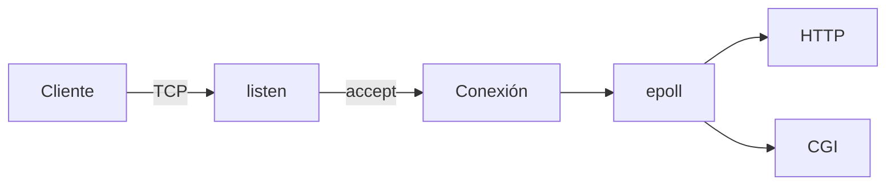

# webserv

Servidor HTTP/1.1 en C++98. Un solo hilo atiende muchas conexiones TCP con `epoll`. Los CGI son procesos aparte, unidos al mismo bucle por pipes.

Hecho en 42 Madrid, con alepinto y dcid-san.

## Qué enseña

| | |
| --- | --- |
| Sockets | `socket`, `bind`, `listen`, `accept` sobre TCP (`AF_INET`, `SOCK_STREAM`) |
| No bloqueante | `O_NONBLOCK` y `SO_REUSEADDR` en el socket de escucha |
| Varias conexiones | Un `epoll` para clientes, sockets de escucha y pipes de CGI |
| Procesos | CGI con `fork` / `execve`. El padre no se bloquea en el hijo |
| HTTP | GET, POST, DELETE, HEAD, PUT, OPTIONS, CGI, subidas y configuración al estilo nginx |

## Una petición



`epoll_wait` es el único sitio donde el proceso duerme. Si `recv` o `send` no pueden seguir, se vuelve al bucle y el kernel avisa cuando el socket está listo. El detalle de ese diseño está en [docs/DESIGN.md](docs/DESIGN.md).

## Uso

```bash
make
./webserv conf/default.conf
```

Escucha en el puerto 8080. La configuración trae sitio estático, subidas en `/uploads` y un CGI de ejemplo.

## Código

| Pieza | Qué hace |
| --- | --- |
| `src/core/ServerSocket.cpp` | Crear, enlazar, escuchar y aceptar |
| `src/core/Reactor.cpp` | `epoll` y reparto de eventos |
| `src/core/Connection.cpp` | Lectura, escritura y estado de cada cliente |
| `src/http/` | Petición, respuesta y cada método |
| `src/cgi/CgiHandler.cpp` | Proceso CGI y sus pipes |
